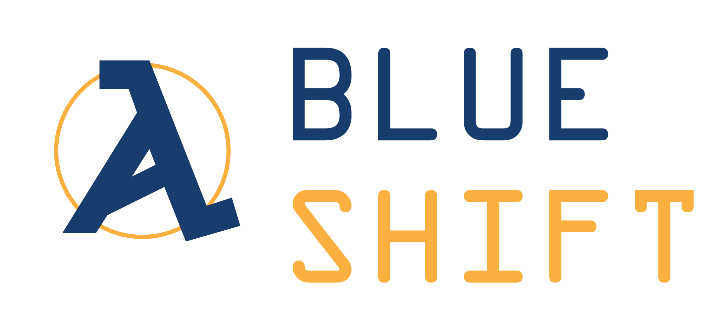

# FTC Rover Ruckus
> Rover Ruckus robot code created by the programmers of Team Blue Shift [FTC5549].

(Work on Progress NPM and Build Status)  
[![NPM Version][npm-image]][npm-url]
[![Build Status][travis-image]][travis-url]

This repository is the version control hub of Team Blue Shift [FTC5549] for the FIRST Tech Challenge 2018-2019 event "Rover Ruckus". Updating nearly daily, the repository will include a collection of Autonomous and TeleOP programs as well as custom libraries and objects used during our team's competition matches.

Blue Shift shares all of our code so that other teams may learn from our programming and so that we may also learn from others. We are completely transparent with our progress.

## Release History

* 0.0.1
    * 20-grit programming, barely a release

## Meta

Gabriel Wong – [gabrieljw1](https://github.com/gabrieljw1/) – gabrieljw1@gmail.com  
Kevin Jones  - [@] -  
Joonha Kang  - [@] -  

Distributed under the XYZ license. See ``LICENSE`` for more information.

[https://github.com/BlueShift-FTC5549/Rover-Ruckus](https://github.com/BlueShift-FTC5549/)
